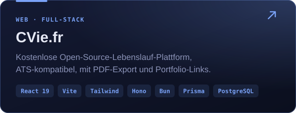
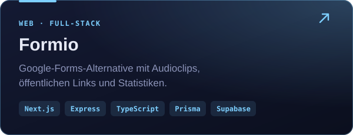
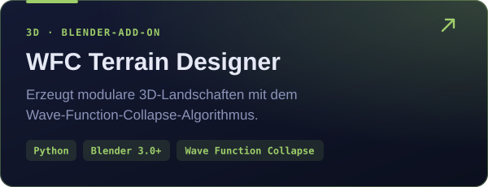
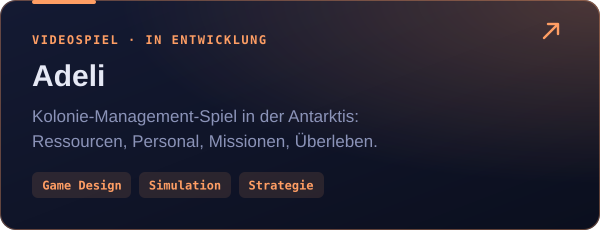

<!-- 🇩🇪 Deutsche Version · Français (Standard): README.md · English: README.en.md -->
<!-- Die Bilder in assets/ werden von scripts/generate_assets.py erzeugt -->

[🇫🇷 Français](https://github.com/Fadi1089/Fadi1089/blob/main/README.md) · [🇬🇧 English](https://github.com/Fadi1089/Fadi1089/blob/main/README.en.md) · **🇩🇪 Deutsch**

## 🧑‍💻 Wer bin ich?

Im Alltag mache ich **Webentwicklung** und **Spieleentwicklung**, beruflich wie in eigenen Projekten. Im Web baue ich **Full-Stack-Anwendungen in TypeScript**, von der Oberfläche bis zur Datenbank. Bei Spielen reizt mich alles, was unter der Haube passiert: **3D-Grafik**, **Echtzeit-Rendering** und **prozedurale Generierung**, kleine, einfache Regeln, aus denen ganze Welten entstehen.

Außerdem studiere ich **Informatik (BUT Informatique)** am IUT Robert Schuman in Straßburg.

  

## 🎮 Ausgewählte Projekte

  
  
  
  

  
   
  <i>Ein mit WFC Terrain Designer in Blender erzeugtes Gelände.</i>

**Außerdem:** [Pokandemaths](https://github.com/Fadi1089/Pokandemaths) (Lernspiel im Pokémon-Stil, Java) · [KeepBoard](https://github.com/Fadi1089/KeepBoard) (Zwischenablage-Verlauf für Linux, Python) · [C-Network-Programming](https://github.com/Fadi1089/C-Network-Programming) (Netzwerkprogrammierung in C)

## 🧰 Stack

<table>
  <tr><td><b>Front-end</b></td><td></td></tr>
  <tr><td><b>Back-end</b></td><td></td></tr>
  <tr><td><b>Spiele & 3D</b></td><td></td></tr>
  <tr><td><b>Systeme & Tools</b></td><td></td></tr>
</table>

## 📊 Aktivität

  

  

<b>📈 Detaillierte Metriken anzeigen</b>

 

## 📬 Kontakt

Ich rede immer gern über **Web**, **Spiele**, **3D** oder ein **spannendes Projekt**, auf Französisch, Englisch oder Deutsch. Ich bin nett 😀

<i>„Pläne sind gut. Aber manchmal muss man einfach so tun, als wüsste man, was man tut.“ — Jim Halpert</i>

