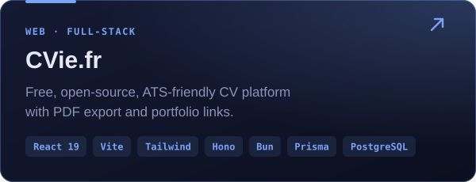
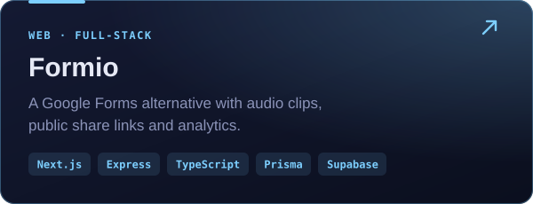
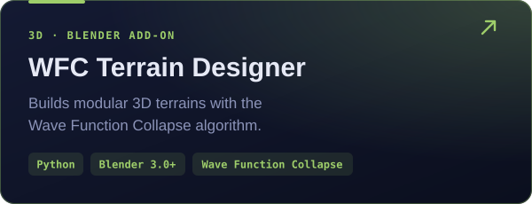
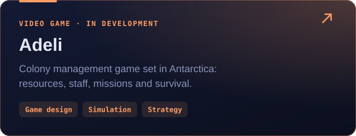
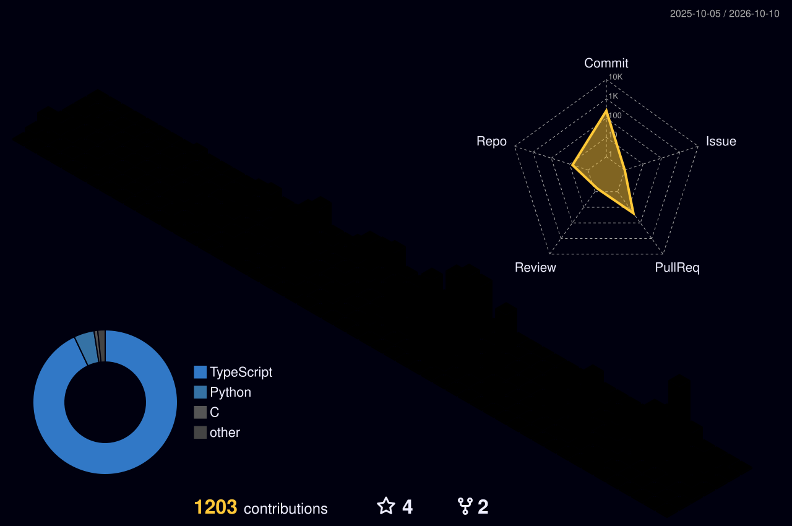

<!-- 🇬🇧 English version · Français (default): README.md · Deutsch: README.de.md -->
<!-- Images in assets/ are generated by scripts/generate_assets.py -->

[🇫🇷 Français](https://github.com/Fadi1089/Fadi1089/blob/main/README.md) · **🇬🇧 English** · [🇩🇪 Deutsch](https://github.com/Fadi1089/Fadi1089/blob/main/README.de.md)

## 🧑‍💻 Who am I?

Day to day, I do **web development** and **game development**, both at work and in my own projects. On the web side, I build **full-stack TypeScript** apps, from the UI down to the database. On the game side, I love everything under the hood: **3D graphics**, **real-time rendering** and **procedural generation**, those small, simple rules that give birth to entire worlds.

I’m also a **Computer Science student (BUT Informatique)** at IUT Robert Schuman in Strasbourg.

  

## 🎮 Featured projects

  
  
  
  

  
   
  <i>A terrain generated in Blender with WFC Terrain Designer.</i>

**Also:** [Pokandemaths](https://github.com/Fadi1089/Pokandemaths) (Pokémon-style educational game, Java) · [KeepBoard](https://github.com/Fadi1089/KeepBoard) (clipboard history for Linux, Python) · [C-Network-Programming](https://github.com/Fadi1089/C-Network-Programming) (network programming in C)

## 🧰 Stack

<table>
  <tr><td><b>Front-end</b></td><td></td></tr>
  <tr><td><b>Back-end</b></td><td></td></tr>
  <tr><td><b>Games & 3D</b></td><td></td></tr>
  <tr><td><b>Systems & tools</b></td><td></td></tr>
</table>

## 📊 Activity

  

  

<b>📈 See detailed metrics</b>

 

## 📬 Get in touch

Always happy to talk **web**, **games**, **3D** or a **cool project**, in French, English or German. I’m friendly 😀

<i>“Plans are great. But sometimes you just have to pretend you know what you’re doing.” — Jim Halpert</i>

