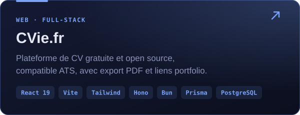
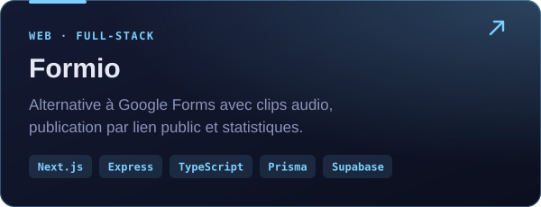
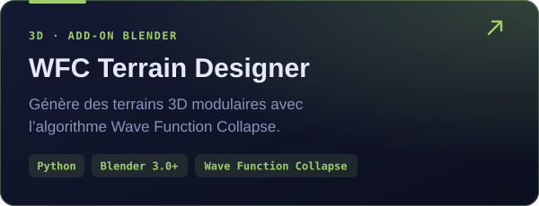
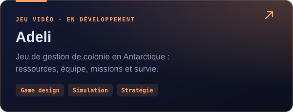

<!-- 🇫🇷 Version française (par défaut) · English : README.en.md · Deutsch : README.de.md -->
<!-- Les images de assets/ sont générées par scripts/generate_assets.py -->

**🇫🇷 Français** · [🇬🇧 English](https://github.com/Fadi1089/Fadi1089/blob/main/README.en.md) · [🇩🇪 Deutsch](https://github.com/Fadi1089/Fadi1089/blob/main/README.de.md)

## 🧑‍💻 Qui suis-je ?

Au quotidien, je fais du **développement web** et du **développement de jeux vidéo**, en entreprise comme en projets perso. Côté web, je construis des applis **full-stack en TypeScript**, de l’interface jusqu’à la base de données. Côté jeu, j’aime tout ce qui se passe sous le capot : **graphismes 3D**, **rendu temps réel** et **génération procédurale**, ces petites règles simples qui font naître des mondes entiers.

Je suis aussi étudiant en **BUT Informatique** à l’IUT Robert Schuman (Strasbourg).

  

## 🎮 Projets phares

  
  
  
  

  
   
  <i>Un terrain généré dans Blender avec WFC Terrain Designer.</i>

**Et aussi :** [Pokandemaths](https://github.com/Fadi1089/Pokandemaths) (jeu éducatif façon Pokémon, Java) · [KeepBoard](https://github.com/Fadi1089/KeepBoard) (historique du presse-papiers pour Linux, Python) · [C-Network-Programming](https://github.com/Fadi1089/C-Network-Programming) (programmation réseau en C)

## 🧰 Stack

<table>
  <tr><td><b>Front-end</b></td><td></td></tr>
  <tr><td><b>Back-end</b></td><td></td></tr>
  <tr><td><b>Jeux & 3D</b></td><td></td></tr>
  <tr><td><b>Systèmes & outils</b></td><td></td></tr>
</table>

## 📊 Activité

  <picture>
    <source media="(prefers-color-scheme: dark)" srcset="https://raw.githubusercontent.com/Fadi1089/Fadi1089/main/profile-3d-contrib/profile-night-rainbow.svg">
    <source media="(prefers-color-scheme: light)" srcset="https://raw.githubusercontent.com/Fadi1089/Fadi1089/main/profile-3d-contrib/profile-season.svg">
    
  </picture>

  

<b>📈 Voir les métriques détaillées</b>

 

## 📬 Me contacter

Toujours partant pour parler **web**, **jeux vidéo**, **3D** ou d’un **projet sympa**, en français, en anglais ou en allemand. Je suis sympa 😀

<i>« Les plans, c’est bien. Mais parfois, il faut juste faire semblant de savoir ce qu’on fait. » — Jim Halpert</i>

